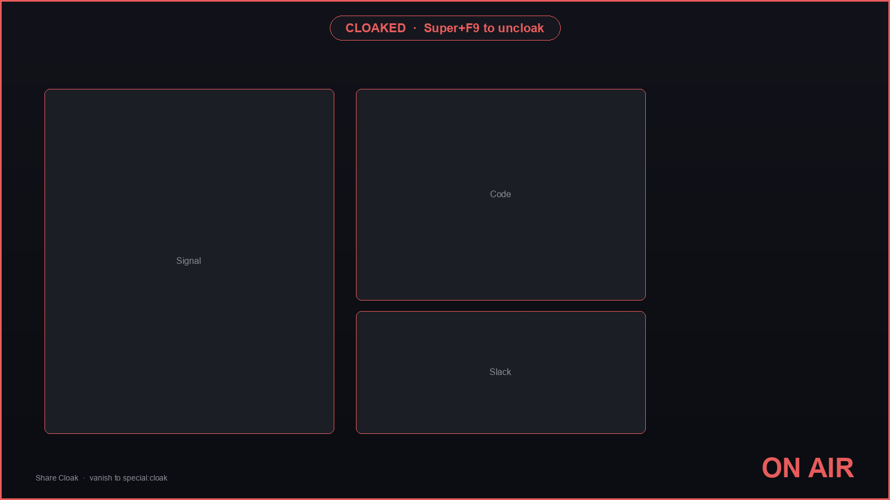
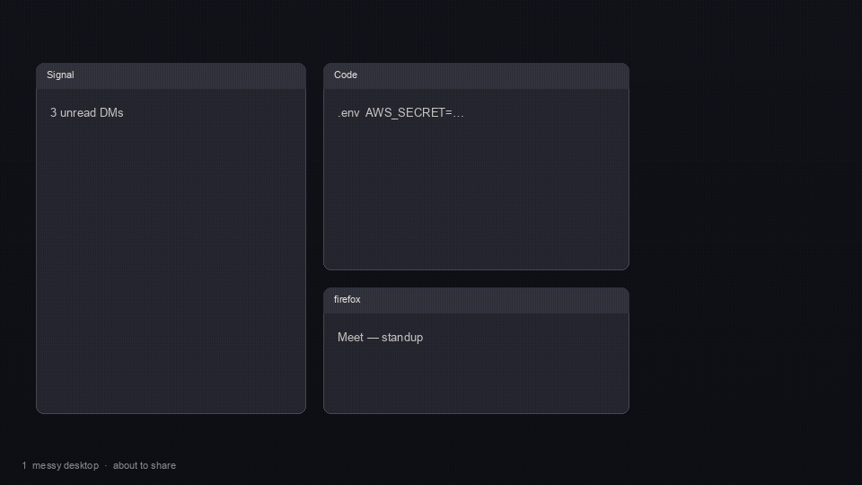

# Share Cloak

One key builds a presenter desktop. Marked windows vanish onto `special:cloak`, notifications pause, a clean theme plate covers the wallpaper, and an ON AIR frame stays up until you uncloak.

This is an Omarchy shell plugin (service + overlay + bar-widget). It runs inside the long-lived `omarchy-shell` process. It does not start a second Quickshell instance.

Auto-cloak is **on by default**: start a full-output share (Zoom / Meet / OBS / wf-recorder) and the desktop dresses itself.





The GIF is a constructed six-beat storyboard of the real sequence (messy desktop → `screencast>>1,0` → vanish to `special:cloak` → ON AIR → restore). It is not a live Hyprland capture from this machine.

## Install

```sh
omarchy plugin add <git-url> --enable
```

Then, on the Omarchy machine, build the optional helper (pw-dump parsing + `0600` session files). There is no committed Linux binary from this Mac — `./build.sh` compiles it on the target, and GitHub Actions (`.github/workflows/ci.yml`) publishes a Linux `cloak-probe` artifact. The plugin QML works without the binary.

```sh
~/.config/omarchy/plugins/io.github.chris.share-cloak/build.sh
```

To ship a tarball without `src/cloak-probe/target/` or review-harness debris, pack git-tracked files only:

```sh
./scripts/pack-plugin.sh   # writes dist/share-cloak.git.tar.gz via git archive
```

Put the chip on the bar if `--enable` did not:

```sh
omarchy bar put io.github.chris.share-cloak --section right
```

Reload plugins if the shell was already running:

```sh
omarchy-shell shell rescanPlugins
```

## Usage

| Combo | Action |
|---|---|
| Super+F9 | Toggle cloak / uncloak (also restores an interrupted session) |
| Super+F10 | Mark the focused window's class (stays marked forever) |
| Bar chip, left click | Same as Super+F9 |
| Bar chip, right click | Open the mark list |

On plugin load the service reads `hyprctl -j binds`. Super+F9 / F10 are installed with `hyprctl keyword bind` only when that combo is free (or already ours). At teardown the service re-reads `hyprctl -j binds` and unbinds a combo only when the live action still belongs to this plugin — a user who rebound Super+F9 while the plugin was loaded keeps their binding. If a combo is taken or `hyprctl` fails, the bar chip is the fallback and the chip tooltip says so. They call:

```
omarchy-shell shell call io.github.chris.share-cloak toggle ''
omarchy-shell shell call io.github.chris.share-cloak markFocused ''
```

`call` always takes `<id> <method> <arg>`. No-argument methods pass an empty argument. If a bind collides with one you already have, the bar chip still works; you can `hyprctl keyword unbind SUPER,F9`.

### What cloak does

1. Snapshot windows, workspaces, floating geometry, special workspaces, and notification mode to `~/.local/state/share-cloak/session.json`. Every mutation is recorded with **ownership**.
2. **Every marked window** — tiled or floating — moves to `special:cloak`. That move is the **only** protection mechanism. Hyprland does not expose dwindle/master tree JSON, so a tiled window cannot be restored losslessly after leaving the layout. If any marked window is tiled, Cloak **refuses** to start (toast) rather than fake a hide with `alpha 0` / `nofocus` on a still-present tile. Float the window or unmark it, then cloak. Cover cards draw over already-vanished windows.
3. Catch new windows from marked apps the same way: they vanish to `special:cloak`.
4. Optionally dim unmarked windows via per-address `setprop alpha` (no `windowrulev2` accumulation).
5. Cover the wallpaper with an owned below-windows layer plate (theme background + a slight gradient). Restore = destroy the surface.
6. Pause notifications with mako only when a **configured suppression mode** exists (`[mode=…]` with `invisible=1` or `inhibit=1`). Guessed names are never added. After `-a`, Cloak re-reads `makoctl mode` before claiming notifications are managed. Uncloak removes only a mode this plugin added.
7. Draw a 3 px ON AIR frame and a `CLOAKED · Super+F9 to uncloak` chip on the overlay layer.

Uncloak replays owned mutations in reverse, verifies each window address still exists **and is no longer on `special:cloak`**, and lists anything unrestorable in a toast. If `hyprctl` or a restore batch fails, `session.json` is kept and Super+F9 retries. User changes made while cloaked (you moved a window off `special:cloak`) are preserved.

Bar chip states: **cloak** (idle) / **CLOAK** (armed, watching for a share) / **ON AIR**.

## Honest limitations

- **Vanish, not blur.** Hyprland has no per-client capture-blur primitive. **Every** marked window is moved to `special:cloak`. `alpha 0` / `nofocus` on a still-present tiled window is not protection — a screencast can still capture it. Cover cards on a full-output share are cosmetic presence indicators drawn over already-hidden windows — they cannot leak content if tracking is late.
- **Tiled marked windows refuse cloak.** Hyprland has no public tiling-tree snapshot. Moving a tiled node reflows siblings and cannot be undone losslessly, so Cloak will not start while a marked window is tiled. Float it or unmark it.
- **Window-share bypass.** If you share a *single window*, Cloak cannot hide that window's own pixels, and layer surfaces (plate, ON AIR frame, cover cards) are not visible to viewers. The `screencast` event's owner field detects this: Cloak warns `WINDOW SHARE — Cloak protects full-screen shares` and still runs DND + the workspace guard + vanish of *other* marked windows. Demo with a full-output share.
- **One-frame flash on unsafe workspace switches.** While cloaked, a workspace event whose target is not in the safe list (the workspace(s) visible at cloak time) covers the output immediately. Safe-list switches never flicker. A one-frame flash of the unsafe workspace is possible; the zero-frame pattern is: share one output, keep unsafe workspaces on the other.
- **Notifications are mako-only.** No dunst path. Only a mako config section that actually suppresses notifications is used. If none is configured, or add+re-read fails, the chip says `notifications: unmanaged`. A suppression mode the user already had on is left alone.
- **Helper binary is optional.** `bin/cloak-probe` is built by `build.sh`. If it is missing, QML falls back to `compat/cloak-probe.sh` and, for share corroboration, to an in-process `pw-dump` JSON parse. Auto-cloak's primary trigger is Hyprland's `screencast` socket2 event, not the helper.
- **Runtime keybinds.** Super+F9 / F10 are installed only if free and tracked as owned. Teardown re-reads live binds and unbinds only when the action still belongs to this plugin. Conflicts leave the bar chip as the control. No `hyprland.conf` edits.
- **ON AIR frame tracks the layer-shell output the overlay landed on** (typically the focused / primary screen). The `screencast` event does not name which monitor is shared.
- **Crash mid-cloak** leaves windows on `special:cloak`. On the next shell start, Share Cloak offers one-key restore (Super+F9) rather than mutating the layout unattended.

## Settings

These keys are read **only** from the bar-widget layout entry in `shell.json`. The same keys on a `plugins[]` service entry are ignored, so load order cannot fight the widget.

| Key | Default | Meaning |
|---|---|---|
| `autoCloak` | `true` | Cloak when a share starts |
| `workspaceGuard` | `true` | Cover workspaces that were not visible at cloak time |
| `dimOthers` | `true` | `setprop alpha 0.85` on unmarked windows |
| `coverCards` | `true` | Cosmetic cards at hidden windows' last geometry (full-output only) |

Marks (class + title regex) persist in `~/.local/state/share-cloak/marks.json`. They are a growing list from Super+F10 / the popup, not widget settings.

## Tests (off-device)

```sh
./scripts/pack-plugin.sh
node tests/run.js
sh tests/probe-fallback.test.sh
sh scripts/omarchy-plugin-validate.sh
sh tests/live-roundtrip.sh          # Omarchy only: full-set hyprctl round-trip (not run in GitHub CI)
# optional, needs cargo:
cargo test --manifest-path src/cloak-probe/Cargo.toml
```

## License

MIT. See [LICENSE](LICENSE).
